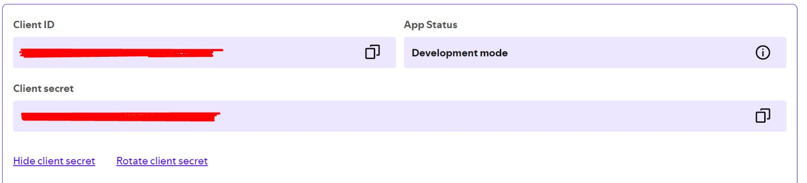

# Projeto de Bot para Discord com Integração ao Spotify

Este projeto é um bot para Discord que utiliza a biblioteca `discord.py` e integra funcionalidades do Spotify usando a biblioteca `spotipy`. Atualmente em desenvolvimento!

## Pré-requisitos

Antes de começar, você vai precisar ter instalado em sua máquina as seguintes ferramentas:

- Python 3.8 ou superior
- Pip (gerenciador de pacotes do Python)
- ffmpeg

## Instalação

### 1. Clone o repositório

```bash
git clone [https://github.com/seu-usuario/seu-repositorio.git](https://github.com/AlisonFernando/Music-Bot-Discord)
cd seu-repositorio

### 2.Crie um ambiente virtual (opcional, mas recomendado)

```bash
python -m venv venv
source venv/bin/activate   # No Linux/MacOS
venv\Scripts\activate      # No Windows
```
### 3. Instale as dependências do projeto

```bash
pip install -r requirements.txt
```

## 4. Instale o FFmpeg

O bot utiliza o FFmpeg para manipulação de áudio, então é necessário instalar essa ferramenta.

### Windows

- Windows - Faça o download do FFmpeg através do link [FFmpeg - Download Windows](https://www.gyan.dev/ffmpeg/builds/). - Download Windows.

- Extraia o conteúdo do arquivo baixado em uma pasta de sua escolha.

- Adicione o caminho da pasta bin do FFmpeg (por exemplo: C:\ffmpeg\bin) à variável de ambiente PATH:

- Abra o Painel de Controle -> Sistema e Segurança -> Sistema -> Configurações avançadas do sistema.

- Clique em Variáveis de Ambiente....

- Em Variáveis do sistema, selecione a variável Path e clique em Editar.

- Adicione o caminho para a pasta bin do FFmpeg.

- Clique em OK em todas as janelas abertas.

## Linux/MacOS

### Para instalar o FFmpeg, você pode usar um gerenciador de pacotes:

```bash
sudo apt update && sudo apt install ffmpeg      # No Ubuntu/Debian
brew install ffmpeg                             # No macOS com Homebrew
```

## 5. Configure as credenciais do Spotify

### Este projeto requer credenciais da API do Spotify. Siga os passos abaixo:

- Crie um aplicativo no Spotify Developer Dashboard.

- Crie um aplicativo no [Spotify Developer Dashboard](https://developer.spotify.com/dashboard/applications).-

- Crie um cliente do Spotify:

- Clique em "Criar um cliente do Spotify" e siga as instruções para criar um cliente do Spotify.

- Obtenha as credenciais do cliente do Spotify: 

- Clique em "Mostrar credenciais" e copie as credenciais do cliente do Spotify.

## 6. Executando o Bot

```bash
python bot.py
```
